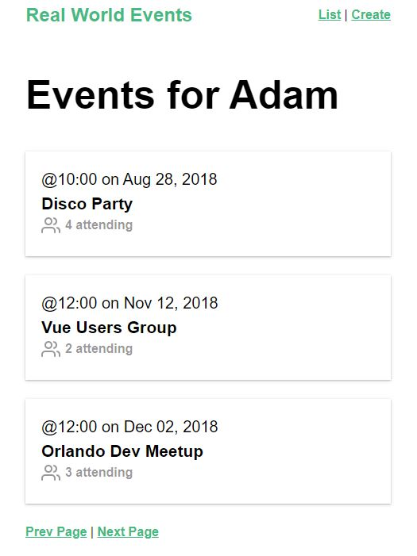

# real-world-vue

> My training Vue CLI project by Vue Mastery
> course https://www.vuemastery.com/

## Project features

- Navigation menu
- Fetching events from json-server
- Creating events
- Event reading
- Pagination
- Vue Router was applied
- Application built with Vue Components
- API calls with Axios
- Vuex for State Management
